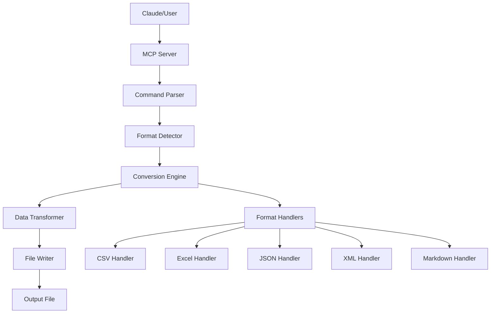

# Design Document

## Overview

FormatForge MCP is designed as a TypeScript-based Model Context Protocol server that provides file format conversion capabilities through Anthropic's Desktop Extensions framework. The system follows a modular architecture with clear separation between format detection, conversion logic, data transformation, and file I/O operations.

The design emphasizes extensibility, allowing new formats to be added easily, and robustness, with comprehensive error handling and validation throughout the conversion pipeline.

## Architecture

### High-Level Architecture



### Component Architecture

The system is organized into the following main components:

1. **MCP Server Core** - Handles MCP protocol communication
2. **Command Processing Layer** - Parses natural language commands
3. **Format Detection Engine** - Identifies input file formats
4. **Conversion Engine** - Orchestrates the conversion process
5. **Format Handlers** - Specific logic for each supported format
6. **Data Transformation Layer** - Applies user-requested transformations
7. **File I/O Manager** - Handles file system operations

## Components and Interfaces

### MCP Server Interface

```typescript
interface MCPServer {
  name: string;
  version: string;
  commands: Command[];
  handleRequest(request: MCPRequest): Promise<MCPResponse>;
}

interface Command {
  name: string;
  description: string;
  parameters: ParameterSchema;
}
```

### Core Conversion Interface

```typescript
interface ConversionRequest {
  sourcePath: string;
  targetFormat: SupportedFormat;
  outputPath?: string;
  transformations?: DataTransformation[];
  options?: ConversionOptions;
}

interface ConversionResponse {
  success: boolean;
  outputPath?: string;
  message: string;
  warnings?: string[];
}

type SupportedFormat = 'csv' | 'xlsx' | 'json' | 'xml' | 'md';
```

### Format Handler Interface

```typescript
interface FormatHandler {
  canHandle(format: SupportedFormat): boolean;
  read(filePath: string, options?: ReadOptions): Promise<DataStructure>;
  write(data: DataStructure, filePath: string, options?: WriteOptions): Promise<void>;
  validate(data: DataStructure): ValidationResult;
}
```

### Data Transformation Interface

```typescript
interface DataTransformer {
  transformKeys(data: DataStructure, style: KeyStyle): DataStructure;
  filterData(data: DataStructure, criteria: FilterCriteria): DataStructure;
  manipulateColumns(data: DataStructure, operations: ColumnOperation[]): DataStructure;
}

type KeyStyle = 'camelCase' | 'snake_case' | 'lowercase' | 'uppercase';
```

## Data Models

### Core Data Structure

```typescript
interface DataStructure {
  headers?: string[];
  rows: Record<string, any>[];
  metadata: {
    originalFormat: SupportedFormat;
    encoding: string;
    sheetName?: string;
    totalRows: number;
    totalColumns: number;
  };
}
```

### Configuration Models

```typescript
interface ConversionOptions {
  encoding?: string;
  sheetName?: string;
  sheetIndex?: number;
  includeHeaders?: boolean;
  dateFormat?: string;
  nullValue?: string;
}

interface FilterCriteria {
  columnFilters?: ColumnFilter[];
  dateRange?: DateRange;
  customConditions?: string[];
}

interface ColumnOperation {
  type: 'add' | 'remove' | 'rename';
  columnName: string;
  newName?: string;
  defaultValue?: any;
}
```

## Error Handling

### Error Classification

1. **File System Errors**
   - File not found
   - Permission denied
   - Invalid path
   - Disk space issues

2. **Format Errors**
   - Unsupported format
   - Corrupted file
   - Invalid structure
   - Encoding issues

3. **Conversion Errors**
   - Data type mismatches
   - Missing required fields
   - Transformation failures
   - Memory limitations

4. **Validation Errors**
   - Schema violations
   - Constraint failures
   - Range errors

### Error Handling Strategy

```typescript
class ConversionError extends Error {
  constructor(
    message: string,
    public code: ErrorCode,
    public details?: any
  ) {
    super(message);
  }
}

enum ErrorCode {
  FILE_NOT_FOUND = 'FILE_NOT_FOUND',
  PERMISSION_DENIED = 'PERMISSION_DENIED',
  UNSUPPORTED_FORMAT = 'UNSUPPORTED_FORMAT',
  CONVERSION_FAILED = 'CONVERSION_FAILED',
  VALIDATION_FAILED = 'VALIDATION_FAILED'
}
```

### Recovery Mechanisms

- **Graceful Degradation**: Continue with partial data when possible
- **Retry Logic**: Automatic retry for transient failures
- **Fallback Options**: Alternative conversion paths for edge cases
- **User Guidance**: Clear error messages with suggested solutions

## Testing Strategy

### Unit Testing

- **Format Handlers**: Test each format handler independently
- **Data Transformations**: Verify all transformation operations
- **Validation Logic**: Test edge cases and error conditions
- **File I/O Operations**: Mock file system interactions

### Integration Testing

- **End-to-End Conversions**: Test complete conversion workflows
- **MCP Protocol**: Verify proper MCP communication
- **Error Scenarios**: Test error handling and recovery
- **Performance**: Validate with large files and datasets

### Test Data Strategy

```typescript
interface TestCase {
  name: string;
  input: {
    format: SupportedFormat;
    data: any;
    options?: ConversionOptions;
  };
  expected: {
    format: SupportedFormat;
    data: any;
    transformations?: DataTransformation[];
  };
  shouldFail?: boolean;
  expectedError?: ErrorCode;
}
```

### Testing Framework

- **Unit Tests**: Jest with TypeScript support
- **Integration Tests**: Custom MCP test harness
- **File System Tests**: Mock file system using `memfs`
- **Performance Tests**: Benchmark with various file sizes

### Test Coverage Requirements

- Minimum 90% code coverage
- 100% coverage for error handling paths
- All supported format combinations tested
- Edge cases and boundary conditions covered

## Implementation Considerations

### Performance Optimization

- **Streaming Processing**: Handle large files without loading entirely into memory
- **Lazy Loading**: Load format handlers only when needed
- **Caching**: Cache parsed data for repeated operations
- **Parallel Processing**: Process multiple files concurrently when possible

### Security Considerations

- **Path Validation**: Prevent directory traversal attacks
- **File Size Limits**: Prevent resource exhaustion
- **Permission Checks**: Validate file access before operations
- **Input Sanitization**: Clean user input to prevent injection attacks

### Extensibility Design

- **Plugin Architecture**: Easy addition of new format handlers
- **Transformation Pipeline**: Composable transformation operations
- **Configuration System**: Flexible options and defaults
- **Hook System**: Allow custom processing at key points

### Dependencies

**Core Dependencies:**
- `@anthropic-ai/mcp-server`: MCP protocol implementation
- `papaparse`: CSV parsing and generation
- `exceljs`: Excel file handling
- `xml2js`: XML parsing and generation
- `marked`: Markdown processing

**Development Dependencies:**
- `jest`: Testing framework
- `typescript`: Type checking and compilation
- `eslint`: Code linting
- `prettier`: Code formatting